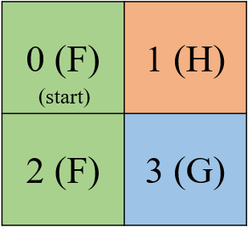

# Frozen lake environment
*Main idea: https://gym.openai.com/envs/FrozenLake-v0/*

## Install
1. Clone
   ```
   git clone https://github.com/rostislavrd/frozen-lake-environment.git
   ```
2. Go to environment directory: 
    ```
    cd fozen-lake-environment
    ```
3. Register environment
    ```
    pip install -e frozen_lake
    ```
4. Test environment
    ```
    pytest
    ```

## Quick start
```python
# For work with gym environments
# (installed with environment)
import gym

# Initialize environment
env = gym.make('frozen_lake:default-v0')
# Reset environment
env.reset()

# Enjoy! Do step and work!
new_state_index, reward, done, _ = env.step(0)
```

## Description
*Winter is here. You are school student which returning home after school. Usually you walk home across nearest lake bridge, but today is winter. The shortest way to your home is across the river.* ***Your mission is to get across the river and stay dry.*** 

- Environment states: 
  - F - Frozen surface (dry place); 
  - H - Ice hole (wet place);
  - G - Goal (opposite waterside, dry place).
- Environment types:
  - Default environment (F - transit states; H and G - terminal states): ```default-v0```;
  - Fall environment (F and H - transit states; G - terminal states): ```fall-v0```;
- Environment actions: 
  - Action: 0 - left, 1 - down, 2 - right and 3 - up;
  - Action sets: 
    - ```default``` - one action = one move direction; 
    - ```slippery``` - one action = three move direction (with any probability you will slide from your way).
- Environment need reset every episode;
- Environment can render: 
  - Board state: ```env.render()``` or ```env.render(object_type='environment')```;
  - Action set: ```env.render(object_type='actions')```;
  - State set: ```env.render(object_type='states')```.

## Environment data

All description based on 2x2 map:



### Transition matrix
Using for work with model based algorithms (which work only on MDP): ```env.transition_matrix``` 
```
# Transition matrix example
transition_matrix = [
  0: {                          # State index:
    0:                          #   Action index (0 - left):
     [                          #     [List of destination states:
        (1.0,                   #       (Transition probability,                 
        0,                      #       Destination state index ,
        0,                      #       Action reward,
        False)],                #       Terminal state flag)] 
        
    1: [(1.0, 2, 0, False)],    # from state with index 0 you can transit 
                                # by action with index 1 (down)
                                # to state with index 2 
                                # with 100% probability, 
                                # receive 0 reward
                                # and state with index 2 is not terminal
    ...
  }
  ...
  2: {                         
    ...
    2: [(1.0, 3, 1, True)],     # from state with index 2 you can transit 
                                # by action with index 2 (right)
                                # to state with index 3 
                                # with 100% probability, 
                                # receive 1 reward
                                # and state with index 3 is terminal
  }
] 
```

### Map data
- Casual text map: ```env.text_map```;
    ```
    # Text map example
    text_map = [
      "FH",
      "FG"
    ] 
    ```
- Relation between state index and position: ```env.index_map```;
    ```
    # Index map example
    index_map = {
      0: (0, 0),
      1: (0, 1),
      2: (1, 0),
      3: (1, 1)
    } 
    ```
- Relation between state position and index: ```env.unindex_map```;
    ```
    # Unindex map example
    unindex_map = {
      (0, 0): 0,
      (0, 1): 1,
      (1, 0): 2,
      (1, 1): 3
    } 
    ```
- Relation between state index and value: ```env.index_value_map```;
    ```
    # Index value map example
    index_value_map = {
      0: "F",
      1: "H",
      2: "F",
      3: "G"
    } 
    ```
- Map sizes: ```env.amount_rows```, ```env.amount_columns``` and ```env.shape``` .
    ```
    # 2x2 example amount rows
    amount_rows = 2 
    # 2x2 example amount columns
    amount_columns = 2 
    # 2x2 example shape
    shape = (2, 2)
    ```

### Other data
- Spaces (amount actions or states): ```env.action_space``` and ```env.observation_space```;
- Action set description: ```env.action_set```;
- State set description (transit or terminal states): ```env.state_set```.


## FAQ

### What "step" function return?
By default "step" function return: observation, reward, done and info. See "Observations" chapter in [gym docs](https://gym.openai.com/docs). 

In current environment:
1. Observation - current state index (do action then move next state);
2. Reward - action reward (do action then receive reward);
3. Done - end of episode (if current state is terminal then game is over);
4. Info - empty, because description is missing.

### What happen if I try to exit from board?
You can't exit from the board. If you do action which try to exit from board then you don't change state (action will ignore)
```
# Example board
# Current state index is 0
+-----------+
| [F|0] H|1 |
|  F|2  G|3 |
+-----------+

# If you choose 0 (left) action 
# then you stay at 0 state
new_state_index, _, _, _ = env.step(0)  # new_state_index = 0 
```

### How set start state?
  ```python
env.reset(start_state_index=0)
```

### Hot set episode size?
```python
gym.make('frozen_lake:default-v0', max_episode_size=100)
```

### Maps

#### Which maps exist?
- "small" - 4x4 map;
- "medium" -8x8 map;
- "large" - 16x16 map;
- "huge" - 32x32 map;
- "colossal" - 100x100 map.

#### How set map?
```python
gym.make('frozen_lake:default-v0', map_name='colossal')
```

### Action sets

#### Which action set exist?
- ```default``` - one action = one move direction;
    ```
    # Example board
    # Current state index is 0
    +-----------+
    | [F|0] H|1 |
    |  F|2  G|3 |
    +-----------+
    
    # (!) We are not considerent exit board cases (!)
    # If you choose 1 (right) action then you go at 1 state
    new_state_index, _, _, _ = env.step(1)  # new_state_index = 1 
    # If you choose 2 (down) action then you go at 2 state
    new_state_index, _, _, _ = env.step(2)  # new_state_index = 2 
    ``` 
- ```slippery``` - one action = three move direction (with any probability you will slide from your way).
    ```
    # Example board
    # Current state index is 2
    +-----------+
    |  F|0  H|1 |
    | [F|2] G|3 |
    +-----------+
    
    # Any action now have chance for execution (you will slide from your way)
    
    # If you choose 3 (up) action then:
    # 1. with 33.33% probability you do up action
    # 2. with 33.33% probability you do left action
    # 3. with 33.33% probability you do right action
    new_state_index, _, _, _ = env.step(3)  # new_state_index = 0 or 2 or 3 
    ``` 

#### How set action set?
```python
gym.make('frozen_lake:default-v0', action_set='slippery')
```

### Render modes

#### Which render modes exist?
- "human" - print current state into console;
- "ascii" - return current state as string.

By default ```env.render()``` using "human" mode.

#### How set render mode?
```python
env.render(mode="human")
```

### Render types

#### Which render types exist?
- "environment" - current board state;
    ```
    # Example
    +---+------------------------+
    |   | 0     1     2     3    |
    +---+------------------------+
    | 0 |[F|0]  F|1   F|2   F|3  |
    | 1 | F|4   H|5   F|6   H|7  |
    | 2 | F|8   F|9   F|10  H|11 |
    | 3 | H|12  F|13  F|14  G|15 |
    +---+------------------------+
    ```
- "actions" - current action set;
    ```
    # Example
    Actions: 0=left, 1=down, 2=right, 3=up
    ```
- "states" - current states set;
    ```
    # Example
    transit_states=['F'], end_states=['H', 'G']
    ```

#### How set render type?
```python
env.render(object_type="environment")
```

### What is gym?
See: [gym docs](https://gym.openai.com/docs).
